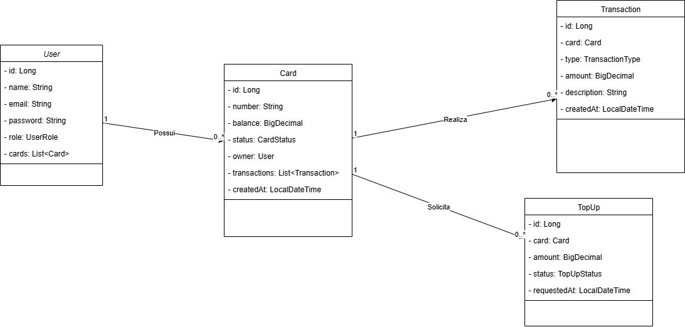

# Web BlueCard

Sistema de Gestão de Cartões e Passagens – Projeto fictício voltado ao controle de bilhetagem eletrônica, desenvolvido como exercício prático para consolidar conhecimentos em tecnologias Full Stack com Java, Vue e Oracle.

---

## 💡 Ideia do Projeto

O Web BlueCard é uma aplicação web que simula um sistema interno para empresas de transporte, permitindo que usuários gerenciem seus cartões de passagem, realizem recargas e acompanhem o histórico de transações. Administradores têm acesso a painéis de controle com funcionalidades avançadas de gestão e validação.

---

## 📌 Funcionalidades

### Usuário (Cliente)

- Criar conta e autenticar via JWT
- Gerenciar seus cartões (cadastro, edição, remoção, visualização)
- Solicitar recargas de saldo
- Visualizar o histórico completo de transações
- Acompanhar status de recarga (pendente, aprovada, recusada)

### Administrador

- Gerenciar usuários (CRUD completo)
- Validar, aprovar ou recusar recargas pendentes
- Consultar e auditar o uso de cartões por usuário
- Acompanhar métricas básicas do sistema (número de cartões ativos, recargas mensais etc.)

### Segurança

- Autenticação com JWT e controle de acesso via Spring Security
- Proteção de rotas por perfil de acesso (usuário ou administrador)
- Frontend com guards de rota para sessões autenticadas

### Funcionalidades adicionais:

- Exportação de dados em CSV (histórico, usuários, recargas)
- Dashboard com gráficos (Vue + Chart.js)
- Logs de auditoria no backend (Spring AOP)
- Integração de APIs externas simuladas para consulta de saldo ou blacklist de cartões

---

## 🖥️ Tecnologias Utilizadas

### Frontend (`bluecard-fed`)

- Vue 3 + TypeScript
- Pinia (gerenciamento de estado)
- Vue Router
- Axios para consumo de APIs
- Validações de formulário com Vuelidate

### Backend (`bluecard-api`)

- Java 17 + Spring Boot
- Spring Security (com JWT)
- JPA/Hibernate para persistência
- Banco de Dados Oracle
- Flyway (migrations)
- Maven para build e dependências

---

## 🧪 Testes e Boas Práticas

- Código baseado em princípios SOLID e Clean Code
- Separação clara entre camadas
- Testes unitários com JUnit e Mockito
- Versionamento com Git seguindo Git Flow

---

## 📁 Estrutura do Projeto

```
/bluecard-fed   # Frontend com Vue
/bluecard-api   # Api Spring Boot
```

---

## 📊 Diagramas

### Diagrama de Classes



### Diagrama Entidade-Relacionamento


---

## 🚀 Como Rodar o Projeto

### Pré-requisitos

- Java 17+ (ou versão compatível com Spring Boot)
- Oracle Database (configurado localmente ou via container)
- Node.js e npm/yarn
- Docker (opcional, para facilitar o setup do banco)

### Backend

1. Configurar o Oracle Database e ajustar as credenciais no arquivo `application.properties` ou `application.yml` do backend.
2. Rodar as migrations com Flyway (automático ao iniciar a aplicação).
3. Executar a API Spring Boot:
   ```bash
   ./mvnw spring-boot:run
   ```

### Frontend

1. Navegar até a pasta `bluecard-fed`
2. Instalar dependências:
   ```bash
   npm install
   ```
3. Rodar a aplicação Vue:
   ```bash
   npm run serve
   ```
4. Acessar via navegador: `http://localhost:8080`

---

## 👨‍💻 Autor

Lucas Tavares – projeto de estudo e prática pessoal.
