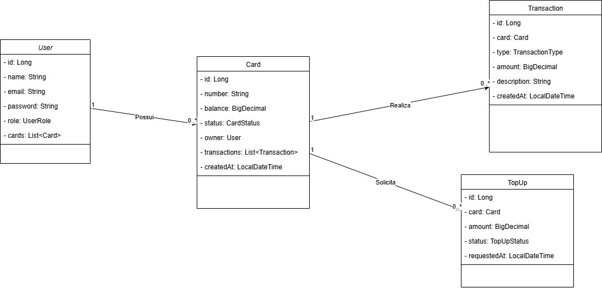
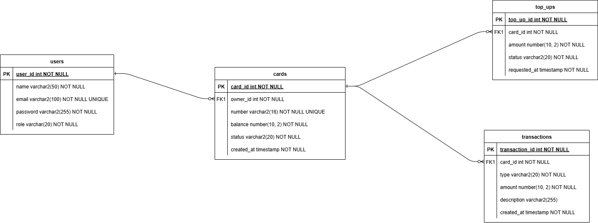

# Web BlueCard

Sistema de Gestão de Cartões e Passagens – Projeto fictício voltado ao controle de bilhetagem eletrônica, desenvolvido como exercício prático para consolidar conhecimentos em tecnologias Full Stack com Java, Vue e Oracle.

---

## 💡 Ideia do Projeto

O Web BlueCard é uma aplicação web que simula um sistema interno para empresas de transporte, permitindo que usuários gerenciem seus cartões de passagem, realizem recargas e acompanhem o histórico de transações. Administradores têm acesso a painéis de controle com funcionalidades avançadas de gestão e validação.

---

## 📌 Funcionalidades

### Usuário (Cliente)

- Criar conta e autenticar via JWT
- Gerenciar seus cartões (solicitação, visualização)
- Solicitar recargas de saldo
- Visualizar o histórico completo de transações
- Acompanhar status de recarga (pendente, aprovada, recusada)

### Fluxo de Solicitação de Novo Cartão

- O cliente solicita um novo cartão via aplicação.
- A requisição entra em um sistema assíncrono que processa a solicitação.
- A aplicação consulta sistemas financeiros externos para validações.
- Após validação, a criação do cartão é realizada.
- O cliente é notificado do status da solicitação por meio de um sistema de notificações.

### Administrador

- Gerenciar usuários (CRUD completo)
- Validar, aprovar ou recusar solicitação de novos cartões
- Validar, aprovar ou recusar recargas pendentes
- Consultar e auditar o uso de cartões por usuário
- Acompanhar métricas básicas do sistema (número de cartões ativos, recargas mensais etc.)

### Segurança

- Autenticação com JWT e controle de acesso via Spring Security
- Proteção de rotas por perfil de acesso (usuário ou administrador)
- Frontend com guards de rota para sessões autenticadas

### Funcionalidades adicionais:

- Exportação de dados em CSV (histórico, usuários, recargas)
- Dashboard com gráficos (Vue + Chart.js)
- Logs de auditoria no backend (Spring AOP)
- Integração de APIs externas simuladas para consulta de saldo ou blacklist de cartões

---

## 🖥️ Tecnologias Utilizadas

### Frontend (`bluecard-fed`)

- Vue 3 + TypeScript
- Pinia (gerenciamento de estado)
- Vue Router
- Axios para consumo de APIs
- Validações de formulário com Vuelidate

### Backend (`bluecard-api`)

- Java 17 + Spring Boot
- Spring Security (com JWT)
- JPA/Hibernate para persistência
- Banco de Dados Oracle
- Flyway (migrations)
- Maven para build e dependências

---

## 🧪 Testes e Boas Práticas

- Código baseado em princípios SOLID e Clean Code
- Separação clara entre camadas
- Testes unitários com JUnit e Mockito
- Versionamento com Git seguindo Git Flow

---

## 📁 Estrutura do Projeto

```
/bluecard-fed   # Frontend com Vue
/bluecard-api   # Api Spring Boot
```

---

## 📊 Diagramas

### Diagrama de Classes



### Diagrama Entidade-Relacionamento



---

## 🚀 Como Rodar o Projeto

### Pré-requisitos

- **Docker** e **Docker Compose** instalados
- (Opcional) `make` para comandos simplificados

### Passos para Rodar

1. **Clonar o repositório**:

   ```bash
   git clone https://github.com/lucastavares10/blue-card.git
   cd blue-card/bluecard-api
   ```

2. **Subir os containers com Docker Compose**:

   ```bash
   docker compose up -d --build
   ```

   Isso irá:

   - Subir o banco Oracle (`oracle-db`)
   - Subir o Kafka
   - Subir a API backend (`bluecard-api`) em `http://localhost:3000`
   - Subir o frontend Vue (`bluecard-fed`) em `http://localhost:8080`

3. **Verificar os logs**:

   - Backend: `docker logs -f api`
   - Frontend: `docker logs -f fed`
   - Banco de Dados Oracle: `docker logs -f oracle-db`

4. **Acessar a aplicação**:
   - Frontend: [http://localhost:8080](http://localhost:8080)
   - Backend (API): [http://localhost:3000/api](http://localhost:3000/api)

---

### Parar os containers

```bash
docker compose down
```

---

### Volumes Persistentes

Os dados do Oracle são armazenados no volume `oracle-data`. Para limpar os dados:

```bash
docker compose down -v
```

---

### Rodando sem Docker (opcional)

Caso queira rodar manualmente:

#### Backend

```bash
cd bluecard-api
./mvnw spring-boot:run
```

#### Frontend

```bash
cd bluecard-fed
npm install
npm run serve
```

---

## 👨‍💻 Autor

Lucas Tavares – projeto de estudo e prática pessoal.
